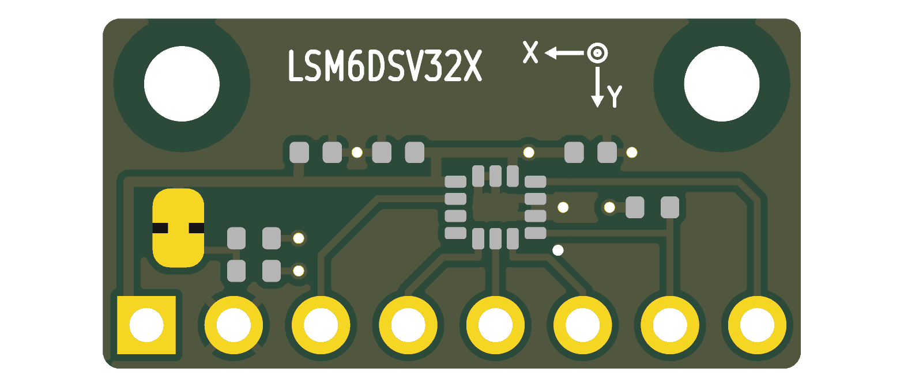
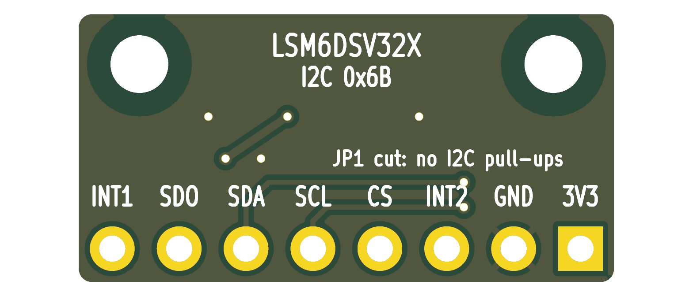

# LSM6DSV32X Breakout

A minimal breakout for the ST **LSM6DSV32X** 6-axis IMU (±32 g accel, ±4000 dps gyro).
The circuit follows the mode 1 connection diagram in ST's datasheet (DS13511, Figure 28,
section 7.1).

| | |
|---|---|
| Board size | **20.32 × 10.2 mm**, 2 layers, 1.6 mm FR4. The width is set by the 8-pin header; the height meets JLCPCB's 10 × 10 mm minimum for assembly. |
| Mounting | Two M2 holes (2.2 mm, non-plated) in the top corners, 15.72 mm apart, 1.9 mm from the top edge. There is no copper within 2 mm of each hole, so a screw head or washer can't short anything. |
| Supply | 3.3 V only. VDD and VDDIO are tied together; there is no regulator or level shifter. |
| Interface | I²C / I3C (default) or SPI (3/4-wire) |
| I²C address | **0x6B** (SA0 pulled up by R3). Drive SDO low for 0x6A. |
| Parts | All SMD on top (0402 passives). The header is inserted from the bottom, so its plastic spacer sits under the board. |




## Header pinout (J1, 2.54 mm, pin 1 = square pad, left when viewed from the top)

| Pin | 1 | 2 | 3 | 4 | 5 | 6 | 7 | 8 |
|---|---|---|---|---|---|---|---|---|
| Signal | 3V3 | GND | INT2 | CS | SCL / SPC | SDA / SDI | SDO / SA0 | INT1 |

The order follows the ring of IMU pads, so every signal is routed on the top layer without
crossings. The pin names are printed on the back silkscreen.

## Circuit notes

- C1 / C2: 100 nF ceramic on VDDIO and VDD, placed next to the supply pins (datasheet Table 2 note 2, section 7.1).
- C3: 4.7 µF footprint on 3V3; may help if the board is fed through long wires or from a noisy robot supply. 
- R1 / R2: 10 k pull-ups on SCL / SDA (R<sub>pu</sub> = 10 kΩ per Figure 28), enabled through **JP1**, a solder jumper that is bridged by
  default. Cut the trace between its pads to remove the pull-ups, for example when the bus already
  has pull-ups or when using SPI.
- R3: 10 k pull-up on SDO/SA0. The SA0 pin has no internal pull-up by default, so without R3 the
  I²C address would be undefined. In SPI mode SDO actively drives the line, so R3 does no harm.
- CS has an internal pull-up, so the part starts in I²C/I3C mode. Pull CS low to use SPI.
- SDx/SCx (pins 2/3) are tied to GND because the analog hub, Qvar and sensor hub are not used.
  OCS_Aux/SDO_Aux (pins 10/11) are left unconnected. Both follow the datasheet's pin table.
- Axes: U1 is rotated 180° on the board. The front silkscreen arrow shows +X pointing left and
  +Y pointing toward the header; +Z points out of the top face.

## Files

| File | Contents |
|---|---|
| `lsm6dsv32x_breakout.kicad_pro/.kicad_sch/.kicad_pcb` | KiCad 9 project |
| `imuboard.kicad_sym`, `sym-lib-table` | Project symbol library (LSM6DSV32X symbol) |
| `fab/lsm6dsv32x_breakout_gerbers.zip` | Gerbers + Excellon drill files, ready to upload |
| `fab/*_bom.csv`, `fab/*_pos_top.csv` | BOM and top-side pick-and-place file (origin: bottom-left corner) |
| `fab/*_bom_jlcpcb.xlsx`, `fab/*_cpl_jlcpcb.xlsx` (+ `.csv`) | The same in JLCPCB's assembly upload format, matching their sample files (SMD parts only; J1 is fitted by hand) |
| `fab/*_schematic.pdf`, `fab/*_assembly_top.pdf` | Printable schematic and assembly drawing |
| `fab/erc.rpt`, `fab/drc.rpt` | Check reports (0 ERC, 0 DRC, 0 unconnected, 0 schematic-parity issues) |
| `tools/` | Generator scripts that produce the files above |

The design is **generated from scripts**. `tools/design.py` holds the netlist,
`tools/gen_schematic.py` writes the schematic, and `tools/gen_pcb.py` does placement,
routing, the GND pours on both layers, and the silkscreen. To rebuild everything, including
the fab outputs and the checks:

```sh
./tools/make_fab.sh
```

You can also edit the `.kicad_sch` / `.kicad_pcb` files directly in KiCad. Regenerating
overwrites those edits.

## Fabrication rules used

- Clearance 0.15 mm (the LGA's 0.5 mm pitch pads are 0.15 mm apart)
- Tracks 0.2 mm for signals, 0.3 mm for 3V3
- Vias 0.5 mm diameter / 0.3 mm drill, tented
- Copper to board edge 0.25 mm
- Copper keepout of 2 mm radius around each mounting hole

These are within standard JLCPCB/PCBWay 2-layer capabilities. The LGA-14 needs stencil and
reflow (or hot air) assembly.

The library footprints' silkscreen was moved to the Fab layers because the board is too dense
for it. For the same reason the project ignores the "footprint differs from library" DRC check.
